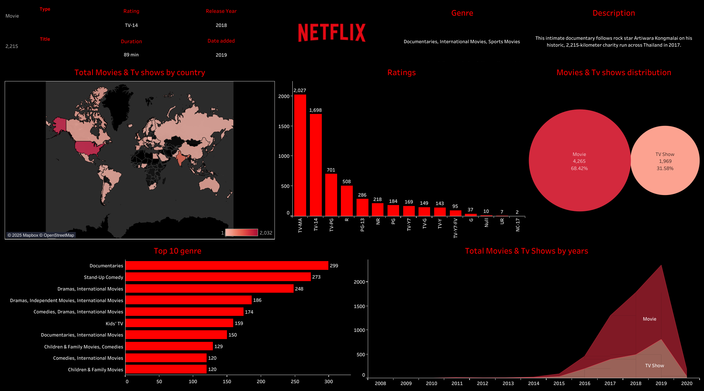

# 📊 Netflix Global Dashboard – Tableau Project

## 🎯 Project Goal
This is my **first complete Tableau dashboard project**, where I visually analyzed Netflix’s global library of movies and TV shows.

---

## 📌 Key Highlights:
- 🌍 **Country-wise content** distribution
- 🎬 **Movie vs TV Show** share
- 🏷️ **Rating-wise breakdown**
- 🎭 **Top genres**
- 📈 **Growth over years**
- 🗺️ **World map** showing Netflix content spread

---

## 🧠 Skills Demonstrated
- Tableau Public Dashboard Design
- Data Cleaning with Excel
- Storytelling with Visualization
- Mapbox Integration
- Genre and Rating Analysis
- Dashboard Theme Matching with Netflix Brand

---

## 📁 Files Included:
| File | Description |
|------|-------------|
| `Netflix.twbx` | Tableau Packaged Workbook |
| `netflix_titles.csv` | Cleaned dataset used |
| `Netflix.png` | Final Dashboard Image |

---

## 📷 Dashboard Snapshot:

---

## 🚀 Tools Used:
- Tableau Public
- Excel
- Mapbox
- GitHub for version control

---

## 💬 Want to Connect?
This is just the beginning of my data journey.  
👉 [Connect with me on LinkedIn](https://www.linkedin.com/in/sahil-raj-36198a250/)

Feel free to fork this repo and explore the project on your own!

---

